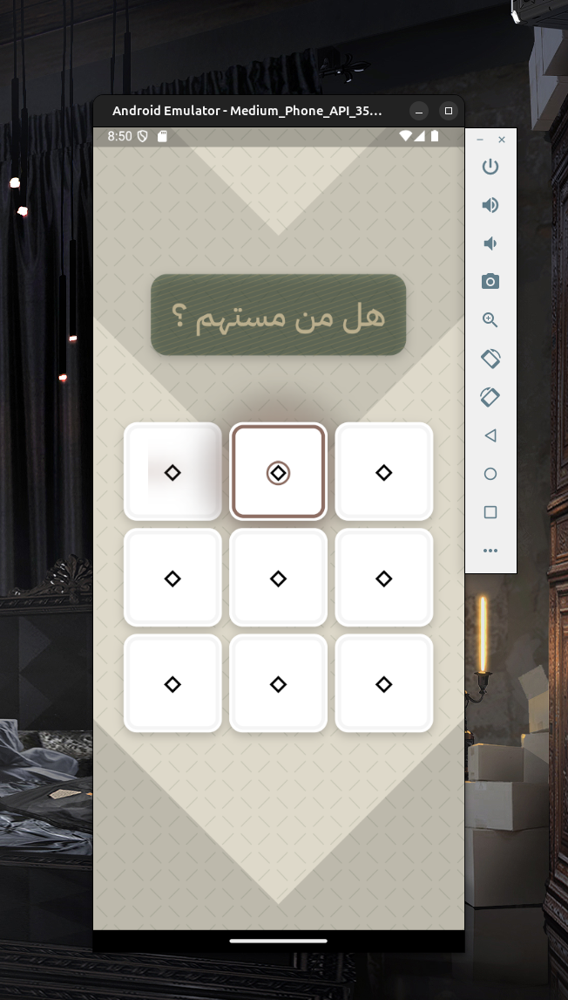

    بسم الله الرحمن الرحيم

# تطبيق سهم

تطبيق [Flutter](https://flutter.dev) بسيط لتسهييل وإحياء سنة "[الاستهام](https://islamic-content.com/dictionary/word/11455/ar)" والقرعة بين الناس إن شاء الله .

<video src="https://github.com/user-attachments/assets/67692a2d-23a5-4eea-8498-f997e334b15e" alt="Linux Recording" width="800"></video>

### الخصائص

- القدرة على الاقتراع بين 9 أشخاص في آن واحد ، وبشكل جذاب !

## الاستخدام

الترميز بالكامل [مفتوح المصدر](#الترخيص) ومتاح للجميع للاستفادة وبناء التطبيق بأنفسهم . ولكننا أيضا نقوم ببناء نسخة جاهزة للتنصيب والاستعمال مع كل تحديث جديد ، لتسهيل الأمر على العامة .

والتعليمات كما يلي :

### نظام أندرويد (الهاتف)

- قم بتحميل آخر إصدار (رقم) من قسم "[الإصدارات](https://github.com/VPremiss/sahm_app/releases)" من صفحتنا هذه ، ومن نوع APK كملف .
- قم بالضغط على الملف نفسه في هاتفك لبدء تنصيبه .
- قم بالسماح للمصادر الغير معروفة بتنزيله ، و بتجاوز فحص الحماية الخاص بـ Google إن طلب .
- قم بتشغيل التطبيق من نفس قائمة التطبيقات الأخرى .

### نظام لينوكس

- قم بتحميل آخر إصدار (رقم) من قسم "[الإصدارات](https://github.com/VPremiss/sahm_app/releases)" من صفحتنا هذه ، ومن نوع .tar.xz كملف .
- قم باستخراج الملف المضغوط .
- قم بتشغيل ملف `sahm_app-linux-x64` في المجلد الرئيسي .

## التطوير

لم يكن هناك وقت كاف للعمل على التصميم ، أو تحسين الأداء من خلال (state management) ، أو حتى نشر التطبيق في المنصات المعروفة . ومع هذا فقد كان أداء التطبيق مفاجئا بشكل إيجابي !

أي مساعدة في التطوير أو التصميم أو الترويج نقدرها لكم ، والله يحب المحسنين ؛ وجزاكم الله خيرا .

### الحزم المستخدمة

- [flutter_svg](https://pub.dev/packages/flutter_svg)
- [shimmer](https://pub.dev/packages/shimmer)
- [diagonal_decoration](https://pub.dev/packages/diagonal_decoration)
- [modal_bottom_sheet](https://pub.dev/packages/modal_bottom_sheet)
- [url_launcher](https://pub.dev/packages/url_launcher)
- [flutter_animate](https://pub.dev/packages/flutter_animate)

- [package_rename](https://pub.dev/packages/package_rename)
- [icons_launcher](https://pub.dev/packages/icons_launcher)
- [flutter_native_splash](https://pub.dev/packages/flutter_native_splash)

### المهمات

- العمل على تنظيم برمجة التطبيق باستخدام [Riverpod](https://riverpod.dev) لإدارة الـ state ، والذي إن شاء الله سيقوم بدوره في دعم سرعة أداء التطبيق بشكل عام .
- إعادة تمصميم من قبل محترف للألوان والانتقالات وكذا الشعار والخلفية .  
- نشر التطبيق في [F-Droid](https://f-droid.org) مفتوح المصدر ، وكذلك في السوق العادي للأندرود .  
- الترويج للتطبيق ونشره من خلال إعادة صياغته بطريقة مفهومة ، ودعم منصات نشره بالكلمات المفتاحية السليمة والمساعدة .

### الإنجاز

يمكنك أيضًا تفقّد [خريطة](](https://github.com/users/VPremiss/projects/11/)) عمل المشروع من خلال صفحته الخاصة .

## الدعم

تستطيعون دعم صيانة وتحسين التطبيق بالإضافة إلى [المشاريع الأخرى](https://github.com/sponsors/VPremiss) التي نعمل عليها ولله الحمد ، أو حتى التبرع [لمرة واحدة](https://github.com/sponsors/VPremiss?frequency=one-time&sponsor=VPremiss) إن كنتم تفضلون ذلك .

ونسأل الله أن يجعلنا وإياكم من المتّقين فيتقبّل ؛ آمين ...

### الترخيص

هذا التطبيق هو ترميز **مفتوح المصدر** تماما ، وذلك وفقًا لترخيص [MIT](LICENSE.md) المعروف . وبذلك يكون متاحًا للجميع استخدامه في ما يرضي الله سبحانه ؛ والله هو الرقيب العليم .

### الإثناءات

- منصة [FlutterGems](https://fluttergems.dev/) <strong>*</strong>
- تطبيق [ChatGPT](https://chat.openai.com)
- تقنية [Flutter](https://flutter.dev)
- كل [الحزم](./pubspec.yaml) المعتمد عليها في هذا التطبيق ...
- وكل الأشخاص الكرماء الذين تعلمنا منهم وقاموا بدعمنا خلال رحلتنا ...

    والحمد لله رب العالمين

